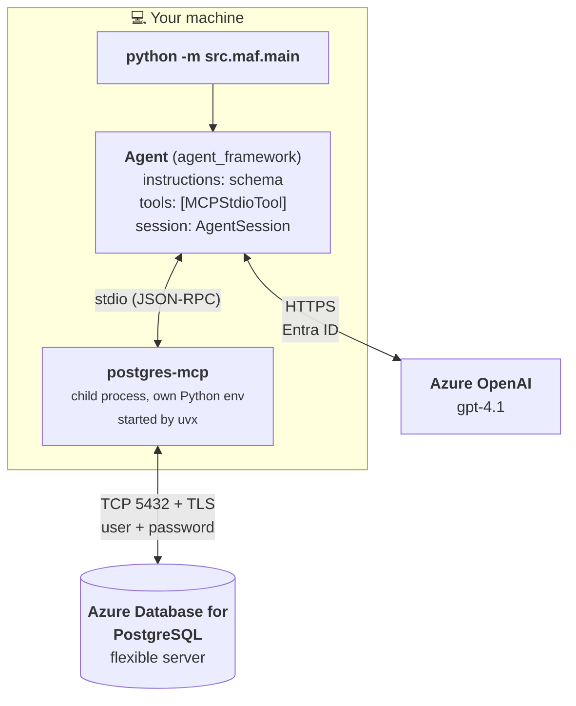
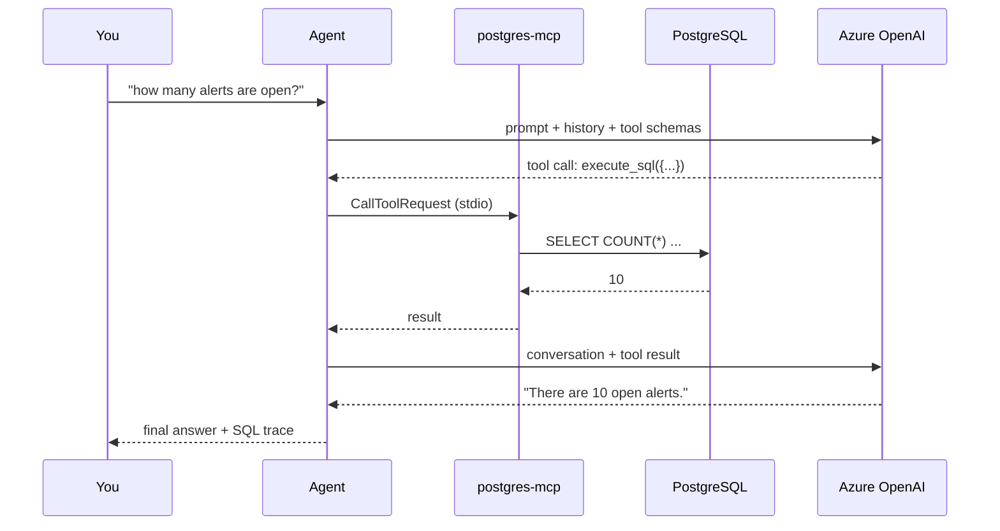
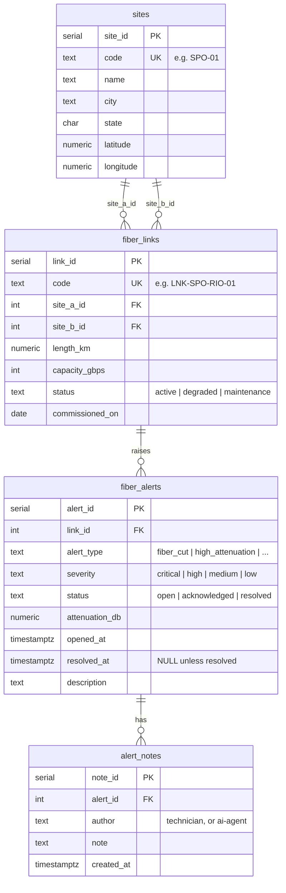

# Architecture

*[Leia em portugues](architecture.pt-BR.md)*

This document explains the moving parts and, more importantly, *why* each choice was made.

---

## The big picture



Two network paths leave your machine, and they are completely separate:

* **To Azure OpenAI** — the agent sends the conversation plus the list of tools it may call, and receives either text or a request to call a tool. Authenticated with Entra ID.
* **To PostgreSQL** — opened by the `postgres-mcp` child process, never by your Python code. Authenticated with a username and password over TLS.

The model never sees the database password. Your Python code never opens a database connection (the one exception, `infra/seed.py`, exists only so you do not need `psql` installed).

---

## One turn, step by step

When you type *"how many alerts are open?"*:



1. `agent.run(...)` sends to Azure OpenAI: the system prompt (which contains the schema), the conversation history from the `AgentSession`, your question, and the JSON schema of every tool the MCP server advertises.
2. The model replies with a **tool call**: `execute_sql({"sql": "SELECT COUNT(*) ..."})`.
3. Agent Framework matches that to `MCPStdioTool` and sends a JSON-RPC `CallToolRequest` over the child process's stdin.
4. `postgres-mcp` runs the statement and writes the result back on stdout.
5. Agent Framework appends the result to the conversation and calls the model again.
6. The model now has real data and produces the final answer.
7. `src/common/trace.py` walks `response.messages` and prints steps 2 and 4 so you can see exactly what happened.

Steps 2–5 can repeat several times in a single turn.

---

## Design decisions

### Why MCP instead of hand-written tool functions?

You could write `@tool def run_sql(sql: str) -> str` with `asyncpg` in about fifteen lines, and the reference samples do exactly that.

MCP wins here because:

* **Zero tool code.** The server advertises its tools, their descriptions and their JSON schemas. Nothing to write, nothing to keep in sync.
* **You get more than you asked for.** `postgres-mcp` also provides `explain_query`, `analyze_workload`, `analyze_db_health` and index-tuning tools. Try *"is my database missing any indexes?"*.
* **It is portable.** The same MCP server works in VS Code, Claude Desktop, or any other MCP host. Your hand-written tool works only in your app.
* **It is a process boundary.** The database credentials live in the child process's environment, not in your agent's address space.

The cost is one extra process and one more thing that can fail to start.

### Why `crystaldba/postgres-mcp`?

The sample has to **write**, which eliminated most candidates:

| Option | Writes? | Verdict |
|---|---|---|
| `crystaldba/postgres-mcp` | Yes, with `--access-mode=unrestricted` | **Chosen** |
| `@modelcontextprotocol/server-postgres` | No — every query runs in a `READ ONLY` transaction | Rejected, and the repo is archived |
| Azure MCP Server postgres tools | No — every tool is annotated read-only | Rejected; also needs subscription/RBAC plumbing |

`postgres-mcp` also has a `restricted` mode, which makes it a good teaching tool: the same server demonstrates both the permissive and the safe configuration.

### Why stdio and not HTTP?

`postgres-mcp` offers `--transport=sse` for network use. Agent Framework 1.x **removed `MCPSSETool`** (SSE has been superseded by Streamable HTTP), so the two do not line up. `stdio` is the transport that works today, and for a local sample it is also the simplest: no ports, no extra service to run.

### Why `uvx` and not `pip install postgres-mcp`?

`postgres-mcp` requires Python 3.12+; this sample supports 3.10+. They genuinely cannot share a virtual environment. `uvx` resolves and caches the server in its own isolated environment on first run, so the sample works on 3.10 regardless.

The `--with "mcp<2"` pin is not optional — see [troubleshooting](troubleshooting.md#mcp-server-failed-to-initialize-connection-closed).

### Why password authentication for PostgreSQL?

Entra ID authentication to Azure PostgreSQL works by minting an access token and using it as the password. Those tokens expire after about an hour, and the MCP server has no hook for refreshing one — it receives a static `DATABASE_URI` at start-up.

Password authentication keeps the sample honest and reproducible. If you need Entra ID in production, put the token refresh in a wrapper that restarts the MCP session, or use a connection pooler that handles it.

### Why is the whole schema in the system prompt?

The MCP server can introspect the schema itself (`list_objects`, `get_object_details`), and the agent would eventually get there. Stating it up front means:

* **Fewer round trips.** Discovering the schema costs two or three extra model calls on every conversation.
* **Fewer hallucinated columns.** The model does not have to guess whether the column is `opened_at` or `created_at`.
* **A place for rules the schema cannot express.** For example: *"when you set status to resolved you must also set `resolved_at`, because a CHECK constraint rejects the row otherwise."*

The trade-off is that the prompt and `infra/seed.sql` must be kept in sync. Treat `FIBEROPS_INSTRUCTIONS` as part of the schema definition.

### Sessions

`AgentSession` is the conversation memory:

```python
session = agent.create_session()
await agent.run("Which link has the most open alerts?", session=session)
await agent.run("Add a note to all of them.", session=session)  # knows "them"
```

Omit `session=` and every call is independent. That is cheaper (no history resent) and correct for a batch of unrelated questions — which is exactly what `src/maf/examples/read_only.py` does.

For persistence beyond process lifetime, Agent Framework provides `SessionStore` and `FileSessionStore`.

---

## The data model



| Table | Rows seeded | Role in the demo |
|---|---|---|
| `sites` | 6 | Points of presence. Read-only in practice. |
| `fiber_links` | 8 | Each connects two sites. Forces the model to write a double self-join. |
| `fiber_alerts` | 25 | The centre of gravity. Mixed statuses and severities. The agent **updates** `status`. |
| `alert_notes` | 5 | The agent's main **insert** target. |

Two deliberate details:

* **Timestamps are relative to `now()`.** The seed data always looks fresh, so questions like *"what happened in the last 24 hours?"* work whenever you run it.
* **A `CHECK` constraint links `status` and `resolved_at`.** Setting `status = 'resolved'` without `resolved_at` is rejected. This gives the agent a real constraint to respect, and gives the system prompt something worth saying.

---

## Firewall detection

The provisioning scripts do something that looks convoluted, so here is why.

The obvious approach is to ask a service like `api.ipify.org` for your public IP and create a firewall rule for it. **This is frequently wrong.** On corporate networks, VPNs and cloud dev boxes, HTTPS traffic often goes through a proxy, so the IP that service reports is the proxy's — not the address PostgreSQL sees on a raw TCP connection to port 5432.

When they differ, the failure is silent and baffling: the rule exists, looks right, and connections still time out with no error from Azure.

So the script:

1. Creates a temporary `0.0.0.0 – 255.255.255.255` rule.
2. Connects and runs `SELECT host(inet_client_addr())` — asking PostgreSQL itself which address it sees.
3. Creates a narrow rule for the surrounding /24.
4. Deletes the temporary rule.

The /24 rather than a single address is a pragmatic choice: many networks NAT through a pool, so the exact octet can change between connections. Narrow it to `/32` if your egress IP is stable.

If step 2 fails (usually because `psycopg` is not installed yet), the script leaves the wide rule in place so you are not blocked, and tells you loudly how to remove it.

### Region restrictions

Many subscriptions — trial, sponsored, MCAP — are blocked from creating PostgreSQL flexible servers in popular regions, failing with *"The location is restricted from performing this operation"*. The resource provider still lists those regions as supported, so you cannot tell in advance from the usual metadata.

The scripts query the capabilities API before trying:

```
GET /subscriptions/{id}/providers/Microsoft.DBforPostgreSQL/locations/{region}/capabilities
```

A non-empty `reason` field on the first entry means the region is blocked. When that happens the script probes a list of alternatives and tells you which ones will work.
