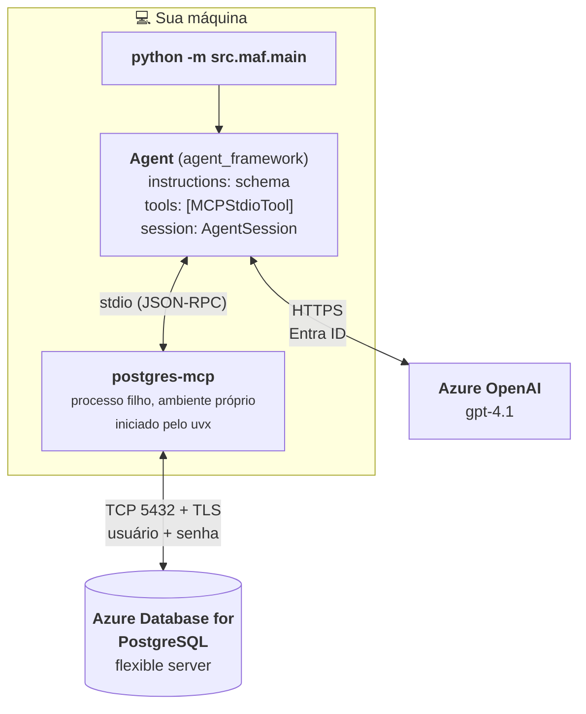
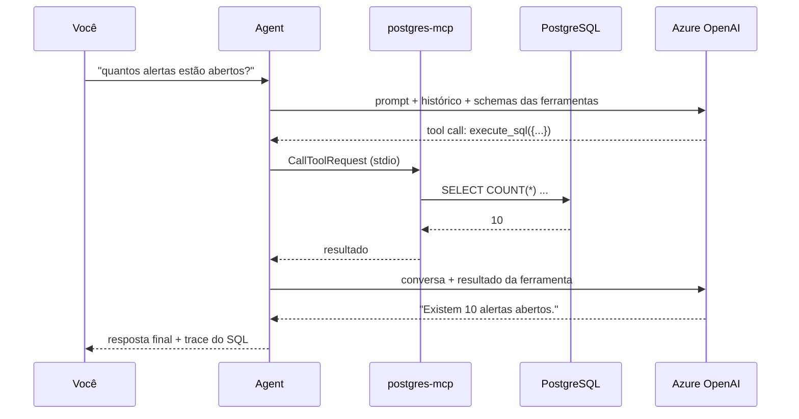
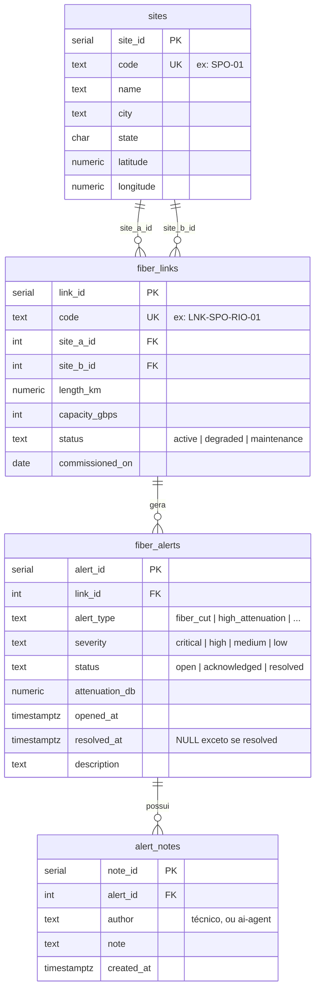

# Arquitetura

*[Read in English](architecture.md)*

Este documento explica as peças e, mais importante, *por que* cada escolha foi feita.

---

## Visão geral



Dois caminhos de rede saem da sua máquina, e eles são completamente separados:

* **Para o Azure OpenAI** — o agente envia a conversa mais a lista de ferramentas que pode chamar, e recebe texto ou um pedido de chamada de ferramenta. Autenticado com Entra ID.
* **Para o PostgreSQL** — aberto pelo processo filho `postgres-mcp`, nunca pelo seu código Python. Autenticado com usuário e senha sobre TLS.

O modelo nunca vê a senha do banco. Seu código Python nunca abre uma conexão de banco (a única exceção, `infra/seed.py`, existe apenas para você não precisar do `psql` instalado).

---

## Um turno, passo a passo

Quando você digita *"quantos alertas estão abertos?"*:



1. `agent.run(...)` envia ao Azure OpenAI: o system prompt (que contém o schema), o histórico da conversa vindo do `AgentSession`, sua pergunta, e o schema JSON de todas as ferramentas anunciadas pelo servidor MCP.
2. O modelo responde com uma **chamada de ferramenta**: `execute_sql({"sql": "SELECT COUNT(*) ..."})`.
3. O Agent Framework associa isso ao `MCPStdioTool` e envia um `CallToolRequest` JSON-RPC pelo stdin do processo filho.
4. O `postgres-mcp` executa o comando e escreve o resultado de volta no stdout.
5. O Agent Framework anexa o resultado à conversa e chama o modelo de novo.
6. Agora o modelo tem dados reais e produz a resposta final.
7. O `src/common/trace.py` percorre `response.messages` e imprime os passos 2 e 4, para você ver exatamente o que aconteceu.

Os passos 2–5 podem se repetir várias vezes num único turno.

---

## Decisões de projeto

### Por que MCP em vez de funções de ferramenta escritas à mão?

Você poderia escrever `@tool def run_sql(sql: str) -> str` com `asyncpg` em umas quinze linhas, e os exemplos de referência fazem exatamente isso.

O MCP ganha aqui porque:

* **Zero código de ferramenta.** O servidor anuncia suas ferramentas, descrições e schemas JSON. Nada para escrever, nada para manter sincronizado.
* **Você ganha mais do que pediu.** O `postgres-mcp` também oferece `explain_query`, `analyze_workload`, `analyze_db_health` e ferramentas de tuning de índices. Experimente perguntar *"está faltando algum índice no meu banco?"*.
* **É portátil.** O mesmo servidor MCP funciona no VS Code, no Claude Desktop ou em qualquer outro host MCP. Sua ferramenta escrita à mão só funciona na sua aplicação.
* **É uma fronteira de processo.** As credenciais do banco ficam no ambiente do processo filho, não no espaço de memória do seu agente.

O custo é um processo a mais e mais uma coisa que pode falhar ao iniciar.

### Por que o `crystaldba/postgres-mcp`?

O exemplo precisa **escrever**, o que eliminou a maioria dos candidatos:

| Opção | Escreve? | Veredito |
|---|---|---|
| `crystaldba/postgres-mcp` | Sim, com `--access-mode=unrestricted` | **Escolhido** |
| `@modelcontextprotocol/server-postgres` | Não — toda query roda numa transação `READ ONLY` | Rejeitado, e o repositório está arquivado |
| Ferramentas de postgres do Azure MCP Server | Não — todas as ferramentas são marcadas como somente leitura | Rejeitado; além disso exige encanamento de subscription/RBAC |

O `postgres-mcp` também tem um modo `restricted`, o que o torna uma boa ferramenta didática: o mesmo servidor demonstra tanto a configuração permissiva quanto a segura.

### Por que stdio e não HTTP?

O `postgres-mcp` oferece `--transport=sse` para uso em rede. O Agent Framework 1.x **removeu o `MCPSSETool`** (SSE foi substituído por Streamable HTTP), então os dois não se encaixam. `stdio` é o transporte que funciona hoje, e para um exemplo local é também o mais simples: sem portas, sem serviço extra para subir.

### Por que `uvx` e não `pip install postgres-mcp`?

O `postgres-mcp` exige Python 3.12+; este exemplo suporta 3.10+. Eles genuinamente não podem compartilhar o mesmo ambiente virtual. O `uvx` resolve e faz cache do servidor no ambiente isolado dele na primeira execução, então o exemplo funciona no 3.10 do mesmo jeito.

O pin `--with "mcp<2"` não é opcional — veja [solução de problemas](troubleshooting.pt-BR.md#mcp-server-failed-to-initialize-connection-closed).

### Por que autenticação por senha no PostgreSQL?

A autenticação Entra ID no Azure PostgreSQL funciona gerando um access token e usando-o como senha. Esses tokens expiram em cerca de uma hora, e o servidor MCP não tem nenhum gancho para renová-los — ele recebe um `DATABASE_URI` estático na inicialização.

A autenticação por senha mantém o exemplo honesto e reprodutível. Se você precisa de Entra ID em produção, coloque a renovação do token num wrapper que reinicie a sessão MCP, ou use um pooler de conexões que trate disso.

### Por que o schema inteiro está no system prompt?

O servidor MCP consegue descobrir o schema sozinho (`list_objects`, `get_object_details`), e o agente eventualmente chegaria lá. Declarar de antemão significa:

* **Menos idas e vindas.** Descobrir o schema custa duas ou três chamadas extras ao modelo em toda conversa.
* **Menos colunas inventadas.** O modelo não precisa adivinhar se a coluna é `opened_at` ou `created_at`.
* **Um lugar para regras que o schema não expressa.** Por exemplo: *"ao mudar o status para resolved você também precisa preencher `resolved_at`, senão uma constraint CHECK rejeita a linha"*.

O custo é que o prompt e o `infra/seed.sql` precisam ser mantidos em sincronia. Trate `FIBEROPS_INSTRUCTIONS` como parte da definição do schema.

### Sessões

`AgentSession` é a memória da conversa:

```python
session = agent.create_session()
await agent.run("Qual enlace tem mais alertas abertos?", session=session)
await agent.run("Adicione uma nota em todos eles.", session=session)  # sabe quem é "eles"
```

Omita o `session=` e cada chamada é independente. Isso é mais barato (não reenvia histórico) e é o correto para um lote de perguntas não relacionadas — que é exatamente o que o `src/maf/examples/read_only.py` faz.

Para persistência além do tempo de vida do processo, o Agent Framework oferece `SessionStore` e `FileSessionStore`.

---

## O modelo de dados



| Tabela | Linhas | Papel na demonstração |
|---|---|---|
| `sites` | 6 | Pontos de presença. Na prática, somente leitura. |
| `fiber_links` | 8 | Cada um conecta dois sites. Obriga o modelo a escrever um self-join duplo. |
| `fiber_alerts` | 25 | O centro de gravidade. Status e severidades variados. O agente faz **UPDATE** no `status`. |
| `alert_notes` | 5 | O principal alvo de **INSERT** do agente. |

Dois detalhes propositais:

* **Os timestamps são relativos a `now()`.** Os dados sempre parecem recentes, então perguntas como *"o que aconteceu nas últimas 24 horas?"* funcionam quando quer que você rode.
* **Uma constraint `CHECK` liga `status` e `resolved_at`.** Definir `status = 'resolved'` sem `resolved_at` é rejeitado. Isso dá ao agente uma restrição real para respeitar, e dá ao system prompt algo que vale a pena dizer.

---

## Detecção de firewall

Os scripts de provisionamento fazem algo que parece complicado demais, então aqui está o motivo.

A abordagem óbvia é perguntar a um serviço como `api.ipify.org` qual é o seu IP público e criar uma regra de firewall para ele. **Isso frequentemente dá errado.** Em redes corporativas, VPNs e dev boxes na nuvem, o tráfego HTTPS costuma passar por um proxy, então o IP reportado é o do proxy — não o endereço que o PostgreSQL enxerga numa conexão TCP crua na porta 5432.

Quando eles diferem, a falha é silenciosa e desconcertante: a regra existe, parece certa, e as conexões continuam dando timeout sem nenhum erro do Azure.

Então o script:

1. Cria uma regra temporária `0.0.0.0 – 255.255.255.255`.
2. Conecta e executa `SELECT host(inet_client_addr())` — perguntando ao próprio PostgreSQL qual endereço ele vê.
3. Cria uma regra estreita para a /24 correspondente.
4. Apaga a regra temporária.

A /24 em vez de um endereço único é uma escolha pragmática: muitas redes fazem NAT através de um pool, então o octeto exato pode mudar entre conexões. Restrinja para `/32` se o seu IP de saída for estável.

Se o passo 2 falhar (normalmente porque o `psycopg` ainda não está instalado), o script deixa a regra ampla no lugar para você não ficar travado, e avisa em alto e bom som como removê-la.

### Restrições de região

Muitas subscriptions — trial, sponsored, MCAP — são bloqueadas de criar PostgreSQL flexible servers nas regiões mais populares, falhando com *"The location is restricted from performing this operation"*. O resource provider continua listando essas regiões como suportadas, então não dá para saber de antemão pelos metadados usuais.

Os scripts consultam a API de capabilities antes de tentar:

```
GET /subscriptions/{id}/providers/Microsoft.DBforPostgreSQL/locations/{regiao}/capabilities
```

Um campo `reason` não vazio na primeira entrada significa que a região está bloqueada. Quando isso acontece, o script testa uma lista de alternativas e informa quais vão funcionar.
