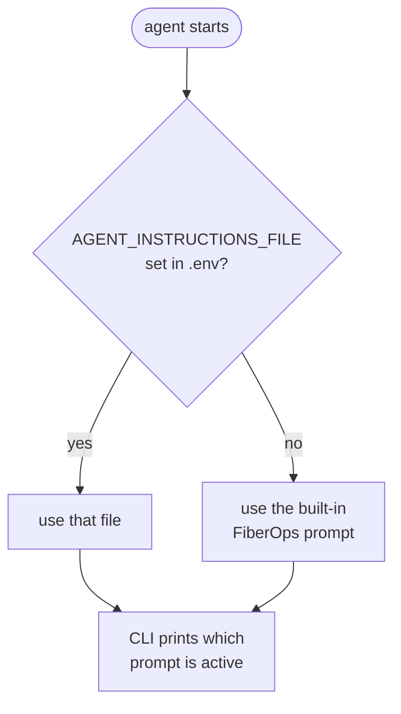

# Using your own database and model

*[Leia em portugues](bring-your-own.pt-BR.md)*

You do **not** have to run `infra/provision.ps1`. If you already have a PostgreSQL database and an Azure OpenAI deployment, this sample works against them with **no code changes** — only `.env`.

This guide covers that path.

---

## The short version

```bash
# 1. Install
pip install -r requirements.txt

# 2. Copy the template
cp .env.example .env

# 3. Edit .env:
#      - point PGHOST/PGDATABASE/PGUSER/PGPASSWORD at your database
#      - point AZURE_OPENAI_ENDPOINT/AZURE_OPENAI_DEPLOYMENT at your model
#      - set AGENT_INSTRUCTIONS_FILE=prompts/auto-discover-schema.md
#      - set POSTGRES_MCP_ACCESS_MODE=restricted   <-- start read-only!

# 4. Run
az login
python -m src.main
```

That is genuinely it. The rest of this document explains each decision.

> **Skip `infra/`.** `provision.*`, `seed.sql` and `seed.py` exist only to create the demo environment. Nothing in `src/` depends on them.

---

## Step 1 — point it at your database

Any PostgreSQL reachable from your machine works: Azure, on-premises, Docker, Amazon RDS, Google Cloud SQL, Neon, Supabase. The agent talks to it through the Postgres MCP server, which just needs a standard connection string.

Edit these five lines in `.env`:

```ini
PGHOST=my-server.example.com
PGPORT=5432
PGDATABASE=my_database
PGUSER=my_user
PGPASSWORD=my_password
PGSSLMODE=require
```

Choosing `PGSSLMODE`:

| Your database | Value |
|---|---|
| Azure Database for PostgreSQL | `require` (mandatory — the service rejects plaintext) |
| Most managed services (RDS, Neon, Supabase) | `require` |
| Local Docker or a dev box | `disable` |
| Not sure | `prefer` — uses TLS when available, falls back otherwise |

### Verify the connection before involving the agent

```bash
python -c "import psycopg,os; from dotenv import load_dotenv; load_dotenv(); print(psycopg.connect(f\"postgresql://{os.environ['PGUSER']}:{os.environ['PGPASSWORD']}@{os.environ['PGHOST']}:{os.environ['PGPORT']}/{os.environ['PGDATABASE']}?sslmode={os.environ['PGSSLMODE']}\").info.server_version)"
```

A version number means you are good. An error here is a networking or credentials problem, not an agent problem — fix it first. See [troubleshooting](troubleshooting.md#postgresql).

### A local Postgres in Docker

If you just want to try the sample without touching Azure at all:

```bash
docker run -d --name pg-agent-demo \
  -e POSTGRES_PASSWORD=devpassword \
  -e POSTGRES_DB=fiberops \
  -p 5432:5432 postgres:16
```

```ini
PGHOST=localhost
PGPORT=5432
PGDATABASE=fiberops
PGUSER=postgres
PGPASSWORD=devpassword
PGSSLMODE=disable
```

Then `python -m infra.seed` loads the FiberOps sample data into it and everything in this repo works, entirely locally except for the model.

---

## Step 2 — point it at your model

```ini
AZURE_OPENAI_ENDPOINT=https://my-resource.openai.azure.com/
AZURE_OPENAI_DEPLOYMENT=my-gpt-4o-deployment
AZURE_OPENAI_API_VERSION=
```

Three things to get right:

**The endpoint must be the `openai.azure.com` form.** A Foundry resource also exposes `https://<name>.services.ai.azure.com/`, which will not work here. Both belong to the same resource; you want the Azure OpenAI one.

**`AZURE_OPENAI_DEPLOYMENT` is your deployment name, not the model name.** List yours:

```bash
az cognitiveservices account deployment list \
  -g <resource-group> -n <resource-name> \
  --query "[].{deployment:name, model:properties.model.name}" -o table
```

**Leave `AZURE_OPENAI_API_VERSION` empty.** Agent Framework uses the Responses API; pinning an older version fails with `400 BadRequest: API version not supported`.

### Which models work?

Anything that supports tool calling. Verified: `gpt-4.1`, `gpt-4.1-mini`, `gpt-4o`, `gpt-4o-mini`.

Smaller models are cheaper and faster but write worse SQL against complex schemas. If the agent starts getting joins wrong, try a larger deployment before rewriting your prompt.

### Authentication

**Entra ID (default, recommended).** Leave `AZURE_OPENAI_API_KEY` unset and run `az login`. You need the **Cognitive Services OpenAI User** role on the resource.

**API key.** If Entra ID is not an option:

```ini
AZURE_OPENAI_API_KEY=abc123...
```

`src/agent.py` switches automatically when it sees a key.

> ⚠️ If `OPENAI_API_KEY` (no `AZURE_` prefix) is set in your shell, Agent Framework prefers it and silently routes to **public OpenAI**. This sample always passes an explicit Azure endpoint so it is safe, but watch for the trap in your own code. `src/config.py` prints a note when it sees that variable.

---

## Step 3 — teach the agent about your schema

**This is the step people skip, and it is the one that matters most.**

By default the agent uses a built-in prompt describing the FiberOps sample schema. Point it at your own database without changing that, and it will confidently look for a `fiber_alerts` table that does not exist.

Set `AGENT_INSTRUCTIONS_FILE` in `.env`. You have two options.

### Option A — let the agent discover the schema (zero effort)

```ini
AGENT_INSTRUCTIONS_FILE=prompts/auto-discover-schema.md
```

The agent inspects your database at run time using the MCP server's introspection tools:

```
[1] list_schemas   -> information_schema, pg_catalog, public
[2] list_objects   {"schema_name": "public"}
                   -> alert_notes, fiber_alerts, fiber_links, sites
[3] execute_sql    SELECT COUNT(*) FROM public.fiber_alerts;
```

**Good for:** trying the sample in five minutes, exploring an unfamiliar database, schemas that change often.

**Costs:** two or three extra model calls at the start of each conversation, and more mistakes when table names are cryptic (`tbl_cst_mstr`) or when two tables could plausibly answer the same question.

### Option B — describe your schema (best results)

```bash
cp prompts/template.md prompts/my-database.md
```

```ini
AGENT_INSTRUCTIONS_FILE=prompts/my-database.md
```

Fill in the tables, the columns and — most importantly — the **allowed values of status-like columns** and any **business rules the schema cannot express**. The model cannot guess that `status` only accepts `'open' | 'closed' | 'archived'`, or that resolving a ticket also requires setting `closed_at`.

Look at `FIBEROPS_INSTRUCTIONS` in [`src/agent.py`](../src/agent.py) for a complete worked example.

#### Shortcut: have the agent write the first draft

1. Start with Option A.
2. Run `python -m src.main` and ask:

   > Inspect this database and write me a concise schema description listing every table, its columns with types, and the relationships between them. Format it like a reference document.

3. Paste the answer into `prompts/my-database.md`, then **edit it** — add the business rules and the safety constraints the agent could not infer.
4. Switch `AGENT_INSTRUCTIONS_FILE` to your file.

This takes about five minutes and is by far the best quality-per-effort option.

### How the prompt is chosen



The CLI tells you which one is active on startup, so you are never guessing:

```
Prompt     : my-database.md
```

---

## Step 4 — start read-only

The sample defaults to `unrestricted` because its whole point is demonstrating writes against a disposable database. **Against your own data, start here instead:**

```ini
POSTGRES_MCP_ACCESS_MODE=restricted
```

The MCP server then permits only read-only transactions. Get comfortable watching the SQL the agent writes, then decide whether to loosen it.

When you are ready for writes, add approvals rather than removing the guardrail entirely:

```ini
POSTGRES_MCP_ACCESS_MODE=unrestricted
POSTGRES_MCP_APPROVAL_MODE=always_require
```

Now every statement is shown to you before it runs. See [`src/examples/human_approval.py`](../src/examples/human_approval.py).

### The guardrail that actually works

Everything above is enforced by software the model is talking to. The only guardrail an LLM genuinely cannot argue its way past is **database permissions**:

```sql
CREATE ROLE agent_readonly LOGIN PASSWORD 'strong-password';
GRANT CONNECT ON DATABASE my_database TO agent_readonly;
GRANT USAGE ON SCHEMA public TO agent_readonly;
GRANT SELECT ON ALL TABLES IN SCHEMA public TO agent_readonly;

-- later, when you want writes on specific tables only:
GRANT INSERT, UPDATE ON alert_notes TO agent_readonly;
```

Put that role in `PGUSER`/`PGPASSWORD`. Now it does not matter what the model decides to try.

You can also hide tools from the model entirely, in `src/agent.py`:

```python
MCPStdioTool(
    ...,
    allowed_tools=["execute_sql", "list_objects", "get_object_details"],
)
```

---

## Step 5 — the examples

`src/main.py` works against any database.

The three scripts in `src/examples/` are written for the FiberOps sample data. They detect when `AGENT_INSTRUCTIONS_FILE` is set and refuse to run rather than doing something meaningless — or destructive — against your tables:

```
This example writes to the FiberOps sample tables (alert_notes,
fiber_alerts), but AGENT_INSTRUCTIONS_FILE is set to my-database.md,
so you are probably pointed at your own database. Refusing to run.
```

To adapt them, edit the `QUESTIONS` list in `read_only.py` or the `STEPS` list in `read_write.py`. They are short and self-contained.

---

## Checklist

Before your first run against your own environment:

- [ ] `pip install -r requirements.txt`
- [ ] `uvx --version` works (install [uv](https://docs.astral.sh/uv/) if not)
- [ ] `.env` exists with your `PG*` values
- [ ] The `psycopg` connection test above succeeds
- [ ] `AZURE_OPENAI_ENDPOINT` uses `openai.azure.com`
- [ ] `AZURE_OPENAI_DEPLOYMENT` is a deployment name you actually have
- [ ] `AZURE_OPENAI_API_VERSION` is **empty**
- [ ] `az login` done, with the **Cognitive Services OpenAI User** role
- [ ] `AGENT_INSTRUCTIONS_FILE` points at a prompt for **your** schema
- [ ] `POSTGRES_MCP_ACCESS_MODE=restricted` for the first run

Then:

```bash
python -m src.main
```

Ask it something you already know the answer to, and check the SQL in the trace. If that looks right, you are in business.

---

## Common adaptations

### A different MCP server

`src/agent.py` builds one `MCPStdioTool`. Swap the command and you have a different backend — MySQL, SQLite, MongoDB, or your own MCP server. Nothing else in the repo changes.

### Several databases at once

`tools=` accepts a list:

```python
tools=[
    build_postgres_mcp_tool(prod_config, mcp_config),
    build_postgres_mcp_tool(analytics_config, mcp_config),
]
```

Give each a distinct `name=` so the model can tell them apart, and mention in your prompt which database holds what.

### Mixing MCP tools with your own functions

```python
def get_current_user() -> str:
    """Return the username of the person operating this agent."""
    return os.environ.get("USERNAME", "unknown")

Agent(client=client, tools=[pg_mcp_tool, get_current_user], ...)
```

Agent Framework turns plain Python functions into tools automatically, using the signature and docstring.

### Not using Azure OpenAI at all

`OpenAIChatClient` also talks to public OpenAI — drop `azure_endpoint` and `credential`, pass `api_key` and a model id. Agent Framework additionally ships connectors for Anthropic, Gemini, Ollama, Foundry Local and others as separate `agent-framework-*` packages. The MCP wiring is identical whichever you choose.
