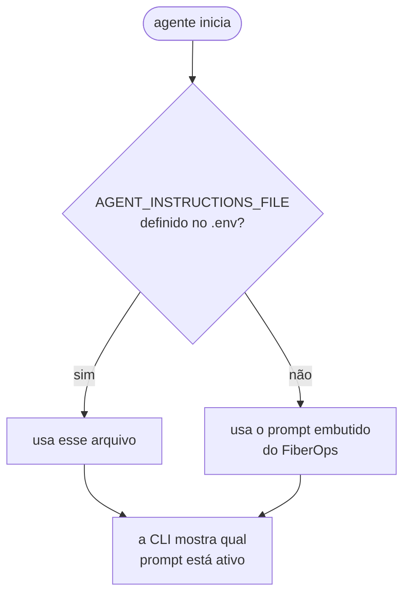

# Usando seu próprio banco e modelo

*[Read in English](bring-your-own.md)*

Você **não** precisa rodar o `infra/provision.ps1`. Se você já tem um banco PostgreSQL e um deployment do Azure OpenAI, este exemplo funciona com eles **sem nenhuma alteração de código** — só o `.env`.

Este guia cobre esse caminho.

---

## Versão curta

```bash
# 1. Instale
pip install -r requirements.txt

# 2. Copie o template
cp .env.example .env

# 3. Edite o .env:
#      - aponte PGHOST/PGDATABASE/PGUSER/PGPASSWORD para o seu banco
#      - aponte AZURE_OPENAI_ENDPOINT/AZURE_OPENAI_DEPLOYMENT para o seu modelo
#      - defina AGENT_INSTRUCTIONS_FILE=prompts/auto-discover-schema.md
#      - defina POSTGRES_MCP_ACCESS_MODE=restricted   <-- comece só-leitura!

# 4. Rode
az login
python -m src.maf.main
```

É isso mesmo. O resto deste documento explica cada decisão.

> **Ignore a pasta `infra/`.** `provision.*`, `seed.sql` e `seed.py` existem só para criar o ambiente de demonstração. Nada em `src/` depende deles.

---

## Passo 1 — aponte para o seu banco

Qualquer PostgreSQL acessível da sua máquina funciona: Azure, on-premises, Docker, Amazon RDS, Google Cloud SQL, Neon, Supabase. O agente fala com ele através do servidor MCP do Postgres, que só precisa de uma string de conexão padrão.

Edite estas cinco linhas do `.env`:

```ini
PGHOST=meu-servidor.exemplo.com
PGPORT=5432
PGDATABASE=meu_banco
PGUSER=meu_usuario
PGPASSWORD=minha_senha
PGSSLMODE=require
```

Escolhendo o `PGSSLMODE`:

| Seu banco | Valor |
|---|---|
| Azure Database for PostgreSQL | `require` (obrigatório — o serviço recusa conexões sem TLS) |
| Maioria dos serviços gerenciados (RDS, Neon, Supabase) | `require` |
| Docker local ou máquina de desenvolvimento | `disable` |
| Não tenho certeza | `prefer` — usa TLS quando disponível, senão cai para sem TLS |

### Verifique a conexão antes de envolver o agente

```bash
python -c "import psycopg,os; from dotenv import load_dotenv; load_dotenv(); print(psycopg.connect(f\"postgresql://{os.environ['PGUSER']}:{os.environ['PGPASSWORD']}@{os.environ['PGHOST']}:{os.environ['PGPORT']}/{os.environ['PGDATABASE']}?sslmode={os.environ['PGSSLMODE']}\").info.server_version)"
```

Se aparecer um número de versão, está tudo certo. Um erro aqui é problema de rede ou credencial, não do agente — resolva isso primeiro. Veja a [solução de problemas](troubleshooting.pt-BR.md#postgresql).

### Um Postgres local no Docker

Se você só quer experimentar o exemplo sem tocar no Azure:

```bash
docker run -d --name pg-agent-demo \
  -e POSTGRES_PASSWORD=devpassword \
  -e POSTGRES_DB=fiberops \
  -p 5432:5432 postgres:16
```

```ini
PGHOST=localhost
PGPORT=5432
PGDATABASE=fiberops
PGUSER=postgres
PGPASSWORD=devpassword
PGSSLMODE=disable
```

Depois `python -m infra.seed` carrega os dados de exemplo do FiberOps nele e tudo neste repositório funciona, inteiramente local exceto pelo modelo.

---

## Passo 2 — aponte para o seu modelo

```ini
AZURE_OPENAI_ENDPOINT=https://meu-recurso.openai.azure.com/
AZURE_OPENAI_DEPLOYMENT=meu-deployment-gpt-4o
AZURE_OPENAI_API_VERSION=
```

Três coisas para acertar:

**O endpoint precisa ser do formato `openai.azure.com`.** Um recurso do Foundry também expõe `https://<nome>.services.ai.azure.com/`, que não funciona aqui. Os dois pertencem ao mesmo recurso; você quer o do Azure OpenAI.

**`AZURE_OPENAI_DEPLOYMENT` é o nome do deployment, não o nome do modelo.** Liste os seus:

```bash
az cognitiveservices account deployment list \
  -g <resource-group> -n <nome-do-recurso> \
  --query "[].{deployment:name, model:properties.model.name}" -o table
```

**Deixe `AZURE_OPENAI_API_VERSION` vazio.** O Agent Framework usa a Responses API; fixar uma versão antiga falha com `400 BadRequest: API version not supported`.

### Quais modelos funcionam?

Qualquer um com suporte a tool calling. Verificados: `gpt-4.1`, `gpt-4.1-mini`, `gpt-4o`, `gpt-4o-mini`.

Modelos menores são mais baratos e rápidos, mas escrevem SQL pior em schemas complexos. Se o agente começar a errar joins, experimente um deployment maior antes de reescrever o seu prompt.

### Autenticação

**Entra ID (padrão, recomendado).** Deixe `AZURE_OPENAI_API_KEY` sem valor e rode `az login`. Você precisa da role **Cognitive Services OpenAI User** no recurso.

**API key.** Se Entra ID não for uma opção:

```ini
AZURE_OPENAI_API_KEY=abc123...
```

O `src/maf/agent.py` troca de caminho automaticamente quando encontra uma chave.

> ⚠️ Se `OPENAI_API_KEY` (sem o prefixo `AZURE_`) estiver definida no seu shell, o Agent Framework dá preferência a ela e roteia silenciosamente para o **OpenAI público**. Este exemplo sempre passa um endpoint Azure explícito, então está seguro, mas fique atento à armadilha no seu próprio código. O `src/maf/config.py` imprime um aviso quando encontra essa variável.

---

## Passo 3 — ensine o schema ao agente

**Este é o passo que as pessoas pulam, e é o que mais importa.**

Por padrão o agente usa um prompt embutido que descreve o schema de exemplo do FiberOps. Aponte-o para o seu banco sem mudar isso e ele vai procurar, com toda a confiança, uma tabela `fiber_alerts` que não existe.

Defina `AGENT_INSTRUCTIONS_FILE` no `.env`. Você tem duas opções.

### Opção A — deixe o agente descobrir o schema (esforço zero)

```ini
AGENT_INSTRUCTIONS_FILE=prompts/auto-discover-schema.md
```

O agente inspeciona seu banco em tempo de execução usando as ferramentas de introspecção do servidor MCP:

```
[1] list_schemas   -> information_schema, pg_catalog, public
[2] list_objects   {"schema_name": "public"}
                   -> alert_notes, fiber_alerts, fiber_links, sites
[3] execute_sql    SELECT COUNT(*) FROM public.fiber_alerts;
```

**Bom para:** experimentar o exemplo em cinco minutos, explorar um banco desconhecido, schemas que mudam com frequência.

**Custo:** duas ou três chamadas extras ao modelo no início de cada conversa, e mais erros quando os nomes das tabelas são crípticos (`tbl_cst_mstr`) ou quando duas tabelas poderiam plausivelmente responder à mesma pergunta.

### Opção B — descreva o seu schema (melhores resultados)

```bash
cp prompts/template.md prompts/meu-banco.md
```

```ini
AGENT_INSTRUCTIONS_FILE=prompts/meu-banco.md
```

Preencha as tabelas, as colunas e — o mais importante — os **valores permitidos das colunas de status** e quaisquer **regras de negócio que o schema não expressa**. O modelo não tem como adivinhar que `status` só aceita `'open' | 'closed' | 'archived'`, nem que resolver um chamado exige também preencher `closed_at`.

Veja o `FIBEROPS_INSTRUCTIONS` em [`src/common/prompts.py`](../src/common/prompts.py) como exemplo completo.

#### Atalho: peça ao agente para escrever o primeiro rascunho

1. Comece com a Opção A.
2. Rode `python -m src.maf.main` e pergunte:

   > Inspecione este banco e escreva uma descrição concisa do schema listando todas as tabelas, suas colunas com tipos, e os relacionamentos entre elas. Formate como um documento de referência.

3. Cole a resposta em `prompts/meu-banco.md` e **edite** — acrescente as regras de negócio e as restrições de segurança que o agente não tinha como inferir.
4. Mude o `AGENT_INSTRUCTIONS_FILE` para o seu arquivo.

Isso leva uns cinco minutos e é de longe a melhor relação qualidade/esforço.

### Como o prompt é escolhido



A CLI informa qual está ativo na inicialização, então você nunca fica no escuro:

```
Prompt     : meu-banco.md
```

---

## Passo 4 — comece somente-leitura

O exemplo usa `unrestricted` por padrão porque o objetivo dele é justamente demonstrar escritas num banco descartável. **No seu próprio banco, comece assim:**

```ini
POSTGRES_MCP_ACCESS_MODE=restricted
```

O servidor MCP passa a permitir apenas transações somente-leitura. Ganhe confiança observando o SQL que o agente escreve, e só então decida se vai afrouxar.

Quando estiver pronto para escritas, adicione aprovações em vez de simplesmente remover a proteção:

```ini
POSTGRES_MCP_ACCESS_MODE=unrestricted
POSTGRES_MCP_APPROVAL_MODE=always_require
```

Agora cada comando é mostrado a você antes de rodar. Veja [`src/maf/examples/human_approval.py`](../src/maf/examples/human_approval.py).

### A proteção que realmente funciona

Tudo acima é aplicado por software com o qual o modelo está conversando. A única barreira que um LLM realmente não consegue contornar com conversa são as **permissões do banco**:

```sql
CREATE ROLE agent_readonly LOGIN PASSWORD 'senha-forte';
GRANT CONNECT ON DATABASE meu_banco TO agent_readonly;
GRANT USAGE ON SCHEMA public TO agent_readonly;
GRANT SELECT ON ALL TABLES IN SCHEMA public TO agent_readonly;

-- depois, quando quiser escrita em tabelas específicas:
GRANT INSERT, UPDATE ON alert_notes TO agent_readonly;
```

Coloque essa role em `PGUSER`/`PGPASSWORD`. Aí não importa o que o modelo resolver tentar.

Você também pode esconder ferramentas do modelo por completo, em `src/maf/agent.py`:

```python
MCPStdioTool(
    ...,
    allowed_tools=["execute_sql", "list_objects", "get_object_details"],
)
```

---

## Passo 5 — os exemplos

O `src/maf/main.py` funciona com qualquer banco.

Os três scripts em `src/maf/examples/` foram escritos para os dados de exemplo do FiberOps. Eles detectam quando `AGENT_INSTRUCTIONS_FILE` está definido e se recusam a rodar, em vez de fazer algo sem sentido — ou destrutivo — nas suas tabelas:

```
This example writes to the FiberOps sample tables (alert_notes,
fiber_alerts), but AGENT_INSTRUCTIONS_FILE is set to meu-banco.md,
so you are probably pointed at your own database. Refusing to run.
```

Para adaptá-los, edite a lista `QUESTIONS` no `read_only.py` ou a lista `STEPS` no `read_write.py`. São curtas e autocontidas.

---

## Checklist

Antes da primeira execução no seu ambiente:

- [ ] `pip install -r requirements.txt`
- [ ] `uvx --version` funciona (instale o [uv](https://docs.astral.sh/uv/) se não)
- [ ] `.env` existe com os seus valores `PG*`
- [ ] O teste de conexão com `psycopg` acima funciona
- [ ] `AZURE_OPENAI_ENDPOINT` usa `openai.azure.com`
- [ ] `AZURE_OPENAI_DEPLOYMENT` é um deployment que você realmente tem
- [ ] `AZURE_OPENAI_API_VERSION` está **vazio**
- [ ] `az login` feito, com a role **Cognitive Services OpenAI User**
- [ ] `AGENT_INSTRUCTIONS_FILE` aponta para um prompt do **seu** schema
- [ ] `POSTGRES_MCP_ACCESS_MODE=restricted` na primeira execução

Então:

```bash
python -m src.maf.main
```

Pergunte algo cuja resposta você já conhece e confira o SQL no trace. Se estiver certo, você está pronto.

---

## Adaptações comuns

### Um servidor MCP diferente

O `src/maf/agent.py` monta um `MCPStdioTool`. Troque o comando e você tem outro backend — MySQL, SQLite, MongoDB, ou o seu próprio servidor MCP. Nada mais no repositório muda.

### Vários bancos ao mesmo tempo

O parâmetro `tools=` aceita uma lista:

```python
tools=[
    build_postgres_mcp_tool(config_prod, config_mcp),
    build_postgres_mcp_tool(config_analytics, config_mcp),
]
```

Dê um `name=` distinto para cada um, para o modelo diferenciá-los, e mencione no seu prompt qual banco guarda o quê.

### Misturando ferramentas MCP com suas próprias funções

```python
def get_current_user() -> str:
    """Retorna o nome de usuário de quem está operando este agente."""
    return os.environ.get("USERNAME", "unknown")

Agent(client=client, tools=[pg_mcp_tool, get_current_user], ...)
```

O Agent Framework converte funções Python comuns em ferramentas automaticamente, usando a assinatura e a docstring.

### Não usar Azure OpenAI de jeito nenhum

O `OpenAIChatClient` também conversa com o OpenAI público — remova `azure_endpoint` e `credential`, passe `api_key` e um id de modelo. O Agent Framework ainda traz conectores para Anthropic, Gemini, Ollama, Foundry Local e outros, como pacotes `agent-framework-*` separados. A parte de MCP é idêntica em qualquer caso.
