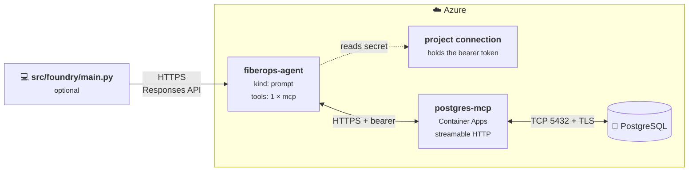

# The same agent, on the Foundry Agent Service

*[Leia em portugues](implementations.pt-BR.md)*

This repo ships the same agent twice.

| | `src/maf/` | `src/foundry/` |
|---|---|---|
| Built with | Microsoft Agent Framework | Foundry Agent Service SDK (`azure-ai-projects`) |
| Where the agent lives | In memory, for as long as your process runs | Stored in a Foundry project, versioned, visible in the portal |
| Who owns the tool loop | Agent Framework | The Agent Service |
| Postgres access | `MCPStdioTool` — a local child process | The same MCP server, hosted, attached as one `mcp` tool |
| Works with no client running | No | Yes |
| Run it | `python -m src.maf.main` | `pwsh infra/deploy-mcp.ps1`, `python -m src.foundry.sync`, `python -m src.foundry.main` |

Same database, same MCP server, same system prompt. Only the runtime changes.

---

## Why this is not just a library swap

A prompt agent runs **inside the Agent Service**. Everything it calls has to be
reachable by the service, and for MCP that means one thing:

> Agent Service only accepts **remote** MCP endpoints — `type: "mcp"` with a
> `server_url` it can reach over HTTPS.

`postgres-mcp` is a local process speaking stdio, started by `uvx`. Nothing in
Azure can launch it. So the tool wiring from `src/maf/agent.py` cannot be carried
over as-is, and any sample that claims otherwise has not run.

The fix is to stop treating that as a limitation and publish the MCP server.
That is what this repo does. A client-side workaround exists and is described
[at the end](#the-alternative-client-side-function-tools), because it is what
most samples reach for and it is worth knowing why we did not.

---

## How it works



The agent definition has **one** tool:

```json
{
  "type": "mcp",
  "server_label": "postgres",
  "server_url": "https://postgres-mcp.<region>.azurecontainerapps.io/mcp",
  "require_approval": "never",
  "project_connection_id": "postgres-mcp"
}
```

Not nine function tools. The service connects to the server, lists the tools and
calls them itself. That matters for more than tidiness: the tool list is
resolved at *call* time, so adding a tool to the MCP server does not require
re-registering the agent.

The database credentials live in the container. `src/foundry/config.py` does not
even read `PGHOST` — the CLI has no idea where the database is.

---

## Publishing the MCP server

`infra/deploy-mcp.ps1` does all of this. It is worth knowing what it is working
around, because none of it is documented in one place.

```powershell
pwsh infra/deploy-mcp.ps1 -AccessMode restricted
```

### 1. The transport is newer than the release

`postgres-mcp` gained `--transport=streamable-http` on `main`; it is not in
v0.3.0, and the published Docker image is older still. `infra/mcp-server/Dockerfile`
therefore installs from a **pinned commit**:

```dockerfile
RUN pip install "postgres-mcp @ https://github.com/crystaldba/postgres-mcp/archive/15c8e333....tar.gz"
```

Pin a commit, not a branch. This is a sample; you should read that code before
running it against anything you care about.

### 2. It has no authentication at all

None. Not a token, not an allow-list. A `postgres-mcp` reachable on the public
internet is an unauthenticated SQL endpoint.

`infra/mcp-server/server.py` wraps it:

```python
class BearerTokenMiddleware(BaseHTTPMiddleware):
    async def dispatch(self, request, call_next):
        if request.url.path == "/healthz":          # probes must not need the token
            return await call_next(request)
        if request.headers.get("authorization") != f"Bearer {self._token}":
            return JSONResponse({"error": "unauthorized"}, status_code=401)
        return await call_next(request)
```

A shared secret is the weakest acceptable answer, not a good one. See
[hardening](#hardening-this) below.

### 3. `execute_sql` is registered in `main()`, not at import

Importing the module gives you eight tools. The ninth — the one that matters —
is registered inside the server's `main()` based on the access mode. Since we
build the ASGI app ourselves, `server.py` has to replicate that registration.

### 4. The MCP SDK rejects the hostname

Straight out of the box, every request came back `421 Misdirected Request`. The
MCP SDK ships DNS-rebinding protection that validates the `Host` header against
an allow-list defaulting to localhost. Behind Container Apps the `Host` header is
the app's FQDN, which is not on it:

```python
postgres_mcp.mcp.settings.transport_security = TransportSecuritySettings(
    allowed_hosts=[os.environ["ALLOWED_HOST"]],
    allowed_origins=[f"https://{os.environ['ALLOWED_HOST']}"],
)
```

The deploy script sets `ALLOWED_HOST` to the app's own FQDN after it knows it,
which is why the app is updated a second time.

### 5. Secrets cannot go in the tool's `headers`

The obvious shape — `MCPTool(headers={"Authorization": f"Bearer {token}"})` — is
rejected:

> *Headers that can include sensitive information are not allowed in the headers
> property for MCP tools. Use project_connection_id instead.*

This is a good constraint: it means the agent definition stays free of secrets
and can be committed. The script creates a `CustomKeys` project connection named
`postgres-mcp` holding the token, and the agent references it by name.

### 6. The database firewall

Container Apps egress comes from a rotating pool of Azure IPs, so pinning
individual addresses does not work — we tried, and ended up with 29 firewall
rules that still missed. The script enables the **Allow Azure services** rule
(`0.0.0.0`) instead.

Be clear-eyed about what that means: it allows *any* Azure tenant to reach the
server, so the database password is the only thing protecting it. For a demo
that is fine. For production, use a VNet-integrated Container Apps environment
with a private endpoint to the database and drop the rule.

---

## Setup

Everything from the [main Quickstart](../README.md#quickstart) still applies —
the database and the MCP server are unchanged. You need three more things in
`.env`:

```ini
FOUNDRY_PROJECT_ENDPOINT=https://<resource>.services.ai.azure.com/api/projects/<project>
FOUNDRY_AGENT_NAME=fiberops-agent
FOUNDRY_MODEL_DEPLOYMENT=gpt-4.1
```

`MCP_SERVER_URL` and `MCP_CONNECTION_NAME` are written for you by the deploy
script. Do not set them by hand.

Three things to get right:

**The endpoint is the project one, not the Azure OpenAI one.** This is the exact
mirror image of the rule for `AZURE_OPENAI_ENDPOINT`, and it catches people just
as often in this direction:

| Variable | Wants | Used by |
|---|---|---|
| `AZURE_OPENAI_ENDPOINT` | `https://<name>.openai.azure.com/` | `src/maf/` (Agent Framework) |
| `FOUNDRY_PROJECT_ENDPOINT` | `https://<name>.services.ai.azure.com/api/projects/<project>` | `src/foundry/` |

Both belong to the same resource. `src/maf/config.py` and `src/foundry/config.py`
reject each one when it is
pasted into the other.

**The model deployment has to exist in that project's resource.** It is the
deployment name, not the model name — check Models + endpoints in the portal.

**You need write permission on agents.** Reading and writing are separate, so
listing agents can work while creating one fails:

```
Identity(object id: ...) does not have permissions for
Microsoft.CognitiveServices/accounts/AIServices/agents/write actions
```

`Azure AI User` on the project is the usual role. Being subscription Owner is
not sufficient by itself. After it is assigned, run `az login` again so the new
role lands in a fresh token.

---

## Register the agent

```powershell
python -m src.foundry.sync
```

```
Project    : https://<resource>.services.ai.azure.com/api/projects/<project>
Agent      : fiberops-agent
Model      : gpt-4.1
MCP server : https://postgres-mcp.<region>.azurecontainerapps.io/mcp
Connection : postgres-mcp
Prompt     : built-in FiberOps sample

Submitting the agent definition...

Done. 'fiberops-agent' is now at version 1.
It has one tool, 'postgres', pointing at the MCP server above.
```

Open the project in the Foundry portal and the agent is there, with its
instructions and that single MCP tool.

Run it again and you get version 2 — the agent is identified by
`FOUNDRY_AGENT_NAME`, and versions are immutable. That makes the sync script the
closest thing this repo has to infrastructure-as-code for an agent: the
definition is in source control, every deployment is recorded in the project.

Re-run it whenever the system prompt, the model or the MCP endpoint changes.
**Not** when the MCP server gains a tool — the definition does not list them.

> The sync does not contact the MCP server. It only submits a definition, so it
> succeeds even if the container is down. You find that out on the first turn.

---

## Talk to it

```powershell
python -m src.foundry.main
```

The experience is deliberately identical to `python -m src.maf.main`, down to the
SQL trace, so you can put the two side by side.

**But this CLI is optional now.** Open the agent in the portal playground and it
answers there too. Nothing runs on your machine — that is the whole point of
this implementation, and the easiest way to convince yourself it is really
working.

---

## One request per turn

This is `src/foundry/main.py`, in full:

```python
AGENT = {"agent_reference": {"name": agent_name, "type": "agent_reference"}}

# On the first turn there is nothing to chain to, and the service rejects an
# explicit null - the parameter has to be absent, not empty.
carry = {"previous_response_id": previous_response_id} if previous_response_id else {}

response = openai_client.responses.create(
    model=model,
    input=user_input,
    extra_body=AGENT,
    **carry,
)
```

That is it. Compare it to the Agent Framework path and the two are now about
equally short — the work moved into the service rather than into your code.

Three things worth noticing:

**`extra_body` is what selects the agent.** Without it you are talking to a bare
model deployment. With it, the instructions and the tool list come from the
stored agent definition — which is why we never resend them. The key is
`agent_reference`; an older `agent` key is rejected with *"The 'agent' property
is deprecated"*, and a lot of material online still shows it.

**`previous_response_id` is the conversation memory.** It replaces
`AgentSession` from the Agent Framework path. `/new` in the CLI just sets it
back to `None` — and note that `None` has to become an *absent* parameter, not
`"previous_response_id": null`, which the service rejects outright.

**The SQL trace is read back, not intercepted.** Because the service made the
tool calls, the CLI finds them afterwards in `response.output`:

```python
def extract_mcp_calls(response):
    return [ToolCall(item.name, item.arguments) for item in response.output
            if item.type == "mcp_call"]
```

Purely cosmetic. Delete it and the agent behaves identically.

---

## Hardening this

The sample is deliberately permissive. In rough order of how much each one buys
you:

1. **A restricted database role.** `GRANT SELECT` and nothing else. The only
   guardrail an LLM cannot talk its way around — see
   [bring-your-own.md](bring-your-own.md#the-guardrail-that-actually-works).
2. **Deploy with `-AccessMode restricted`**, so the MCP server only permits
   read-only transactions. The default in this repo is `unrestricted`, which
   means a public endpoint that can `DROP TABLE`.
3. **`allowed_tools=[...]` on the `MCPTool`**, exposing only what you need.
4. **`require_approval="always"`** until you have watched it run for a while.
   The service then pauses and asks before each call.
5. **Replace the bearer token with Entra ID.** Put Container Apps built-in auth
   or API Management in front of the container and give the project a managed
   identity. A shared secret in a project connection is better than nothing and
   worse than this.
6. **VNet-integrate the container app** and reach the database over a private
   endpoint, so you can drop the *Allow Azure services* firewall rule.

Also note the **100-second cap** on non-streaming MCP tool calls. A slow query
will hit it.

---

## The alternative: client-side function tools

Worth knowing about, because it is what most samples do and it looks simpler.

Foundry supports **client-side function tools**: the agent definition declares a
function's name and JSON schema, and when the model calls it the service does
not execute anything. It hands the call back to whoever is driving the
conversation and waits. You can therefore enumerate the MCP server's nine tools,
declare each as a `FunctionTool`, and run the tool loop yourself against a local
`postgres-mcp`.

It works, and it needs no infrastructure at all — no container, no public
endpoint, and the database never has to be reachable from Azure.

We rejected it for two reasons:

**The agent does not work without you.** In the playground it asks for
`execute_sql` and nobody answers. The agent is in the project, but it is inert —
which defeats most of the reason to use the Agent Service at all.

**It is not an MCP integration.** The portal shows nine `fx` entries, the tool
list is frozen at registration time, and `strict=True` is impossible because
`postgres-mcp`'s schemas do not set `additionalProperties: false`. You have
flattened MCP into a list of functions and kept none of its benefits.

It is a reasonable pattern when the tools genuinely must run client-side —
reading local files, hitting an on-premises system with no ingress. It is the
wrong pattern for a database you could just as well let Azure reach.

---

## Which one should you use?

**Agent Framework (`src/maf/`)** when the agent is part of an application you are
writing. It is less code, it handles streaming and sessions, the agent is just
an object — no deployment step, nothing to keep in sync, and no infrastructure
beyond the database.

**Agent Service (`src/foundry/`)** when the agent itself is the artefact: when
it needs to be discoverable by other people, versioned, governed, evaluated with
the Foundry evaluation tooling, or invoked by something that is not your code.

They are not exclusive. Agent Framework can invoke an agent hosted in Foundry,
which is a reasonable end state: definition and governance in the project,
orchestration in your application.

---

## Troubleshooting

| Symptom | Cause |
|---|---|
| `403 ... agents/write` | Missing the `Azure AI User` role on the project. Assign it, then `az login` again. |
| `FOUNDRY_PROJECT_ENDPOINT looks like an Azure OpenAI endpoint` | You pasted the `openai.azure.com` one. You want `services.ai.azure.com/api/projects/<project>`. |
| `FOUNDRY_PROJECT_ENDPOINT is missing the project path` | The account endpoint alone is not enough — agents belong to a project. |
| Model not found on sync | `FOUNDRY_MODEL_DEPLOYMENT` must name a deployment in the *project's* resource, not the one in `AZURE_OPENAI_ENDPOINT`. |
| `421 Misdirected Request` from the MCP endpoint | The MCP SDK's DNS-rebinding protection. `ALLOWED_HOST` must equal the container app's FQDN. |
| `Headers that can include sensitive information are not allowed` | The bearer token was put in the tool's `headers`. Use `project_connection_id`. |
| `401 unauthorized` from the MCP endpoint | The project connection holds a stale token. Re-run `infra/deploy-mcp.ps1`. |
| The agent answers but never queries anything | The MCP server is unreachable. `curl -H "Authorization: Bearer $env:MCP_AUTH_TOKEN" $env:MCP_SERVER_URL` should not time out. |
| The container logs `connection timeout expired` | The database firewall does not allow Container Apps egress. Re-run `infra/deploy-mcp.ps1`. |
| `MCP server ... Connection closed` | Agent Framework path only — see [troubleshooting.md](troubleshooting.md#mcp-server-failed-to-initialize-connection-closed). |
| The agent talks about fiber alerts, but that is not your database | Set `AGENT_INSTRUCTIONS_FILE`. Both variants read it. See [bring-your-own.md](bring-your-own.md). |

---

## References

- [Foundry Agent Service](https://learn.microsoft.com/azure/ai-foundry/agents/overview)
- [Create agents](https://learn.microsoft.com/azure/ai-foundry/agents/how-to/create-agent)
- [MCP tool](https://learn.microsoft.com/azure/ai-foundry/agents/how-to/tools/mcp)
- [Function calling](https://learn.microsoft.com/azure/ai-foundry/agents/how-to/tools/function-calling)
- [RBAC in Foundry](https://learn.microsoft.com/azure/ai-foundry/concepts/rbac-azure-ai-foundry)
