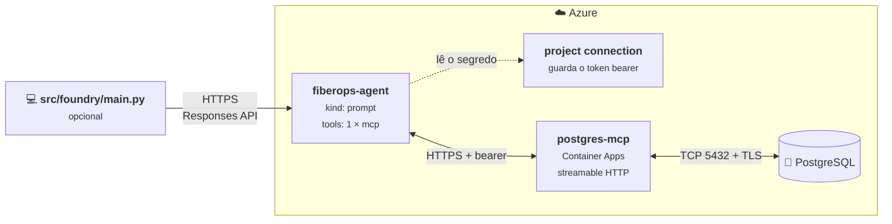

# O mesmo agente, no Foundry Agent Service

*[Read in English](implementations.md)*

Este repositório entrega o mesmo agente duas vezes.

| | `src/maf/` | `src/foundry/` |
|---|---|---|
| Construído com | Microsoft Agent Framework | SDK do Foundry Agent Service (`azure-ai-projects`) |
| Onde o agente vive | Em memória, enquanto seu processo roda | Armazenado num projeto Foundry, versionado, visível no portal |
| Quem controla o laço de ferramentas | O Agent Framework | O Agent Service |
| Acesso ao Postgres | `MCPStdioTool` — um processo filho local | O mesmo servidor MCP, hospedado, anexado como uma tool `mcp` |
| Funciona sem cliente rodando | Não | Sim |
| Como rodar | `python -m src.maf.main` | `pwsh infra/deploy-mcp.ps1`, `python -m src.foundry.sync`, `python -m src.foundry.main` |

Mesmo banco, mesmo servidor MCP, mesmo prompt de sistema. Só o runtime muda.

---

## Por que isso não é apenas trocar de biblioteca

Um prompt agent roda **dentro do Agent Service**. Tudo o que ele chama precisa
ser alcançável pelo serviço, e no caso do MCP isso significa uma coisa:

> O Agent Service só aceita endpoints MCP **remotos** — `type: "mcp"` com um
> `server_url` que ele consiga acessar por HTTPS.

O `postgres-mcp` é um processo local que fala stdio, iniciado pelo `uvx`. Nada
no Azure consegue subir esse processo. Ou seja, a ligação de ferramentas do
`src/maf/agent.py` não pode ser reaproveitada como está — e qualquer exemplo que
afirme o contrário não foi executado.

A solução é parar de tratar isso como limitação e publicar o servidor MCP. É o
que este repositório faz. Existe um contorno do lado do cliente, descrito
[no final](#a-alternativa-function-tools-no-cliente), porque é o que a maioria
dos exemplos escolhe e vale entender por que nós não escolhemos.

---

## Como funciona



A definição do agente tem **uma** ferramenta:

```json
{
  "type": "mcp",
  "server_label": "postgres",
  "server_url": "https://postgres-mcp.<regiao>.azurecontainerapps.io/mcp",
  "require_approval": "never",
  "project_connection_id": "postgres-mcp"
}
```

Não nove function tools. O serviço conecta no servidor, lista as ferramentas e
as chama sozinho. Isso importa além da estética: a lista de ferramentas é
resolvida no momento da *chamada*, então adicionar uma ferramenta ao servidor
MCP não exige registrar o agente de novo.

As credenciais do banco vivem no contêiner. O `src/foundry/config.py` sequer lê
`PGHOST` — a CLI não faz ideia de onde o banco está.

---

## Publicando o servidor MCP

O `infra/deploy-mcp.ps1` faz tudo isso. Vale saber o que ele está contornando,
porque nada disso está documentado num lugar só.

```powershell
pwsh infra/deploy-mcp.ps1 -AccessMode restricted
```

### 1. O transporte é mais novo que a release

O `postgres-mcp` ganhou `--transport=streamable-http` no `main`; não está na
v0.3.0, e a imagem Docker publicada é ainda mais antiga. Por isso o
`infra/mcp-server/Dockerfile` instala a partir de um **commit fixado**:

```dockerfile
RUN pip install "postgres-mcp @ https://github.com/crystaldba/postgres-mcp/archive/15c8e333....tar.gz"
```

Fixe um commit, não um branch. Isto é um exemplo; você deveria ler esse código
antes de rodá-lo contra algo que importa.

### 2. Ele não tem autenticação nenhuma

Nenhuma. Nem token, nem allow-list. Um `postgres-mcp` acessível na internet
pública é um endpoint de SQL sem autenticação.

O `infra/mcp-server/server.py` o envolve:

```python
class BearerTokenMiddleware(BaseHTTPMiddleware):
    async def dispatch(self, request, call_next):
        if request.url.path == "/healthz":          # probes não podem exigir token
            return await call_next(request)
        if request.headers.get("authorization") != f"Bearer {self._token}":
            return JSONResponse({"error": "unauthorized"}, status_code=401)
        return await call_next(request)
```

Um segredo compartilhado é a resposta mais fraca aceitável, não uma boa. Veja
[como endurecer isso](#como-endurecer-isso) adiante.

### 3. O `execute_sql` é registrado no `main()`, não no import

Importar o módulo te dá oito ferramentas. A nona — justamente a que importa — é
registrada dentro do `main()` do servidor, conforme o modo de acesso. Como
montamos a aplicação ASGI nós mesmos, o `server.py` precisa replicar esse
registro.

### 4. O SDK do MCP rejeita o hostname

De cara, toda requisição voltava `421 Misdirected Request`. O SDK do MCP traz
proteção contra DNS rebinding que valida o header `Host` contra uma allow-list
que, por padrão, só tem localhost. Atrás do Container Apps o `Host` é o FQDN do
app, que não está nela:

```python
postgres_mcp.mcp.settings.transport_security = TransportSecuritySettings(
    allowed_hosts=[os.environ["ALLOWED_HOST"]],
    allowed_origins=[f"https://{os.environ['ALLOWED_HOST']}"],
)
```

O script define `ALLOWED_HOST` com o próprio FQDN do app depois de conhecê-lo —
motivo pelo qual o app é atualizado uma segunda vez.

### 5. Segredos não podem ir no `headers` da tool

O formato óbvio — `MCPTool(headers={"Authorization": f"Bearer {token}"})` — é
rejeitado:

> *Headers that can include sensitive information are not allowed in the headers
> property for MCP tools. Use project_connection_id instead.*

É uma boa restrição: significa que a definição do agente fica livre de segredos
e pode ser commitada. O script cria uma project connection `CustomKeys` chamada
`postgres-mcp` com o token, e o agente a referencia pelo nome.

### 6. O firewall do banco

A saída do Container Apps vem de um pool rotativo de IPs do Azure, então fixar
endereços individuais não funciona — tentamos, e terminamos com 29 regras de
firewall que mesmo assim falhavam. O script habilita a regra **Permitir
serviços do Azure** (`0.0.0.0`).

Seja honesto sobre o que isso significa: qualquer tenant do Azure passa a
alcançar o servidor, e a senha do banco vira a única proteção. Para uma demo,
tudo bem. Para produção, use um ambiente Container Apps integrado a VNet com
private endpoint para o banco e remova a regra.

---

## Configuração

Tudo do [Início rápido](../README.pt-BR.md#início-rápido) continua valendo — o
banco e o servidor MCP não mudam. Você precisa de mais três valores no `.env`:

```ini
FOUNDRY_PROJECT_ENDPOINT=https://<recurso>.services.ai.azure.com/api/projects/<projeto>
FOUNDRY_AGENT_NAME=fiberops-agent
FOUNDRY_MODEL_DEPLOYMENT=gpt-4.1
```

O `MCP_SERVER_URL` e o `MCP_CONNECTION_NAME` são escritos pelo script de deploy.
Não os preencha à mão.

Três coisas para acertar:

**O endpoint é o do projeto, não o do Azure OpenAI.** É exatamente a imagem
espelhada da regra do `AZURE_OPENAI_ENDPOINT`, e pega as pessoas com a mesma
frequência nessa direção:

| Variável | Espera | Usada por |
|---|---|---|
| `AZURE_OPENAI_ENDPOINT` | `https://<nome>.openai.azure.com/` | `src/maf/` (Agent Framework) |
| `FOUNDRY_PROJECT_ENDPOINT` | `https://<nome>.services.ai.azure.com/api/projects/<projeto>` | `src/foundry/` |

As duas pertencem ao mesmo recurso. O `src/maf/config.py` e o
`src/foundry/config.py` rejeitam cada uma quando
ela é colada no lugar da outra.

**O deployment do modelo precisa existir no recurso daquele projeto.** É o nome
do *deployment*, não o do modelo — confira em Models + endpoints no portal.

**Você precisa de permissão de escrita em agents.** Leitura e escrita são
permissões separadas, então listar agentes pode funcionar enquanto criar um
falha:

```
Identity(object id: ...) does not have permissions for
Microsoft.CognitiveServices/accounts/AIServices/agents/write actions
```

`Azure AI User` no projeto é o papel usual. Ser Owner da subscription não basta
por si só. Depois de atribuído, rode `az login` de novo para que o novo papel
entre num token novo.

---

## Registrar o agente

```powershell
python -m src.foundry.sync
```

```
Project    : https://<recurso>.services.ai.azure.com/api/projects/<projeto>
Agent      : fiberops-agent
Model      : gpt-4.1
MCP server : https://postgres-mcp.<regiao>.azurecontainerapps.io/mcp
Connection : postgres-mcp
Prompt     : built-in FiberOps sample

Submitting the agent definition...

Done. 'fiberops-agent' is now at version 1.
It has one tool, 'postgres', pointing at the MCP server above.
```

Abra o projeto no portal do Foundry e o agente está lá, com as instruções e
aquela única ferramenta MCP.

Rode de novo e você tem a versão 2 — o agente é identificado pelo
`FOUNDRY_AGENT_NAME`, e versões são imutáveis. Isso faz do script de sync o que
este repositório tem de mais próximo de infraestrutura como código para um
agente: a definição fica no controle de versão e cada implantação fica
registrada no projeto.

Rode novamente sempre que o prompt de sistema, o modelo ou o endpoint MCP mudar.
**Não** quando o servidor MCP ganhar uma ferramenta — a definição não as lista.

> O sync não contata o servidor MCP. Ele só envia uma definição, então funciona
> mesmo com o contêiner fora do ar. Você descobre isso no primeiro turno.

---

## Conversar com ele

```powershell
python -m src.foundry.main
```

A experiência é propositalmente idêntica à do `python -m src.maf.main`, incluindo o
trace de SQL, para você colocar as duas lado a lado.

**Mas essa CLI agora é opcional.** Abra o agente no playground do portal e ele
responde por lá também. Nada roda na sua máquina — é justamente o ponto desta
implementação, e a forma mais fácil de se convencer de que está mesmo
funcionando.

---

## Uma requisição por turno

Este é o `src/foundry/main.py`, por inteiro:

```python
AGENT = {"agent_reference": {"name": agent_name, "type": "agent_reference"}}

# No primeiro turno não há a que encadear, e o serviço rejeita null explícito -
# o parâmetro precisa estar ausente, não vazio.
carry = {"previous_response_id": previous_response_id} if previous_response_id else {}

response = openai_client.responses.create(
    model=model,
    input=user_input,
    extra_body=AGENT,
    **carry,
)
```

É isso. Compare com o caminho do Agent Framework e os dois têm hoje mais ou
menos o mesmo tamanho — o trabalho migrou para o serviço, não para o seu código.

Três pontos que merecem atenção:

**É o `extra_body` que seleciona o agente.** Sem ele, você está falando com um
deployment de modelo puro. Com ele, as instruções e a lista de ferramentas vêm
da definição armazenada — por isso nunca as reenviamos. A chave é
`agent_reference`; a antiga `agent` é rejeitada com *"The 'agent' property is
deprecated"*, e muito material online ainda mostra a antiga.

**O `previous_response_id` é a memória da conversa.** Ele substitui o
`AgentSession` do caminho do Agent Framework. O `/new` da CLI apenas o volta
para `None` — e note que `None` precisa virar um parâmetro *ausente*, e não
`"previous_response_id": null`, que o serviço rejeita.

**O trace de SQL é lido depois, não interceptado.** Como foi o serviço que fez
as chamadas, a CLI as encontra em `response.output`:

```python
def extract_mcp_calls(response):
    return [ToolCall(item.name, item.arguments) for item in response.output
            if item.type == "mcp_call"]
```

Puramente cosmético. Remova e o agente se comporta igual.

---

## Como endurecer isso

O exemplo é propositalmente permissivo. Em ordem aproximada de quanto cada
item entrega:

1. **Uma role restrita no banco.** `GRANT SELECT` e nada mais. A única barreira
   que o modelo não contorna na conversa — veja
   [bring-your-own.pt-BR.md](bring-your-own.pt-BR.md).
2. **Implante com `-AccessMode restricted`**, para o servidor MCP só permitir
   transações somente leitura. O padrão neste repositório é `unrestricted`, ou
   seja, um endpoint público capaz de `DROP TABLE`.
3. **`allowed_tools=[...]` no `MCPTool`**, expondo só o que você precisa.
4. **`require_approval="always"`** até ter observado o comportamento por um
   tempo. O serviço então pausa e pergunta antes de cada chamada.
5. **Troque o token bearer por Entra ID.** Coloque a autenticação nativa do
   Container Apps ou um API Management na frente do contêiner e dê uma managed
   identity ao projeto. Um segredo compartilhado numa project connection é
   melhor que nada e pior que isso.
6. **Integre o container app a uma VNet** e alcance o banco por private
   endpoint, para poder remover a regra de firewall *Permitir serviços do Azure*.

Note também o **teto de 100 segundos** para chamadas MCP não-streaming. Uma
consulta lenta vai esbarrar nele.

---

## A alternativa: function tools no cliente

Vale conhecer, porque é o que a maioria dos exemplos faz e parece mais simples.

O Foundry suporta **function tools executadas no cliente**: a definição do
agente declara o nome e o JSON Schema da função, e quando o modelo a chama o
serviço não executa nada. Ele devolve a chamada para quem está conduzindo a
conversa e aguarda. Dá então para enumerar as nove ferramentas do servidor MCP,
declarar cada uma como `FunctionTool` e rodar o laço de ferramentas você mesmo
contra um `postgres-mcp` local.

Funciona, e não exige infraestrutura nenhuma — sem contêiner, sem endpoint
público, e o banco nunca precisa ser alcançável a partir do Azure.

Recusamos por dois motivos:

**O agente não funciona sem você.** No playground ele pede `execute_sql` e
ninguém responde. O agente está no projeto, mas é inerte — o que anula boa parte
da razão de usar o Agent Service.

**Não é uma integração MCP.** O portal mostra nove entradas `fx`, a lista de
ferramentas congela no momento do registro, e `strict=True` é impossível porque
os schemas do `postgres-mcp` não definem `additionalProperties: false`. Você
achatou o MCP numa lista de funções e não ficou com nenhum benefício dele.

É um padrão razoável quando as ferramentas realmente precisam rodar no cliente —
ler arquivos locais, acessar um sistema on-premises sem entrada. É o padrão
errado para um banco que o Azure poderia perfeitamente alcançar.

---

## Qual dos dois usar?

**Agent Framework (`src/maf/`)** quando o agente é parte de uma aplicação que você
está escrevendo. É menos código, cuida de streaming e sessões, o agente é só um
objeto — sem etapa de implantação, sem nada para manter sincronizado e sem
infraestrutura além do banco.

**Agent Service (`src/foundry/`)** quando o agente em si é o artefato: quando
ele precisa ser descoberto por outras pessoas, versionado, governado, avaliado
com o ferramental de avaliação do Foundry, ou invocado por algo que não é o seu
código.

Não são excludentes. O Agent Framework consegue invocar um agente hospedado no
Foundry, o que é um destino razoável: definição e governança no projeto,
orquestração na sua aplicação.

---

## Solução de problemas

| Sintoma | Causa |
|---|---|
| `403 ... agents/write` | Falta o papel `Azure AI User` no projeto. Atribua e rode `az login` de novo. |
| `FOUNDRY_PROJECT_ENDPOINT looks like an Azure OpenAI endpoint` | Você colou o de `openai.azure.com`. O correto é `services.ai.azure.com/api/projects/<projeto>`. |
| `FOUNDRY_PROJECT_ENDPOINT is missing the project path` | O endpoint da conta sozinho não basta — agentes pertencem a um projeto. |
| Modelo não encontrado no sync | `FOUNDRY_MODEL_DEPLOYMENT` precisa nomear um deployment do recurso *do projeto*, não o do `AZURE_OPENAI_ENDPOINT`. |
| `421 Misdirected Request` vindo do endpoint MCP | A proteção contra DNS rebinding do SDK do MCP. `ALLOWED_HOST` precisa ser igual ao FQDN do container app. |
| `Headers that can include sensitive information are not allowed` | O token bearer foi colocado em `headers` da tool. Use `project_connection_id`. |
| `401 unauthorized` do endpoint MCP | A project connection guarda um token velho. Rode `infra/deploy-mcp.ps1` de novo. |
| O agente responde mas nunca consulta nada | O servidor MCP está inacessível. `curl -H "Authorization: Bearer $env:MCP_AUTH_TOKEN" $env:MCP_SERVER_URL` não deveria dar timeout. |
| O contêiner registra `connection timeout expired` | O firewall do banco não libera a saída do Container Apps. Rode `infra/deploy-mcp.ps1` de novo. |
| `MCP server ... Connection closed` | Só no caminho do Agent Framework — veja [troubleshooting.pt-BR.md](troubleshooting.pt-BR.md). |
| O agente fala de alertas de fibra, mas esse não é o seu banco | Configure `AGENT_INSTRUCTIONS_FILE`. As duas variantes leem essa variável. Veja [bring-your-own.pt-BR.md](bring-your-own.pt-BR.md). |

---

## Referências

- [Foundry Agent Service](https://learn.microsoft.com/azure/ai-foundry/agents/overview)
- [Criar agentes](https://learn.microsoft.com/azure/ai-foundry/agents/how-to/create-agent)
- [MCP tool](https://learn.microsoft.com/azure/ai-foundry/agents/how-to/tools/mcp)
- [Function calling](https://learn.microsoft.com/azure/ai-foundry/agents/how-to/tools/function-calling)
- [RBAC no Foundry](https://learn.microsoft.com/azure/ai-foundry/concepts/rbac-azure-ai-foundry)
